This repository details my setup for retro gaming. While I still own older physical consoles such as the original Xbox and Wii along with media, my retro setup is focused on emulation and game streaming.

My main goal is to stream or emulate and play older games from gaming consoles such as the following.

* PlayStation 2
* Nintendo 64
* GameCube
* Wii

I'd also eventually like to purchase [Sinden Light Guns](https://sindenlightgun.com/) when I have more money and play classic arcade games such as [The House of the Dead](https://en.wikipedia.org/wiki/The_House_of_the_Dead) along with purchase [DDR mats](https://www.ddrgame.com/ddrmatpad.html) so I can play [StepMania](https://www.stepmania.com/) (basically DDR, [Dance Dance Revolution](https://en.wikipedia.org/wiki/Dance_Dance_Revolution), on the PC).

## Previews
Here are some pictures I took while testing my setup on an older monitor I had.

### [WDAL](https://github.com/gamemann/web-desktop-app-launcher) Menu
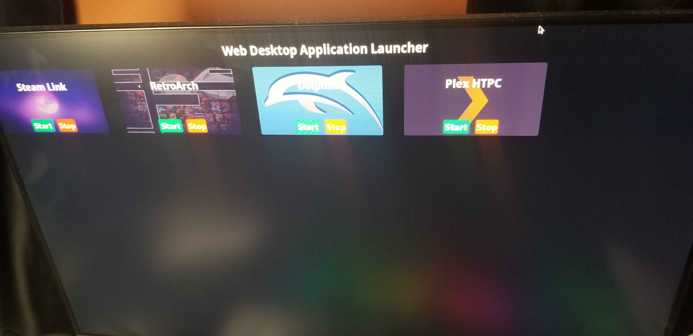

### [RetroArch](https://www.retroarch.com/)
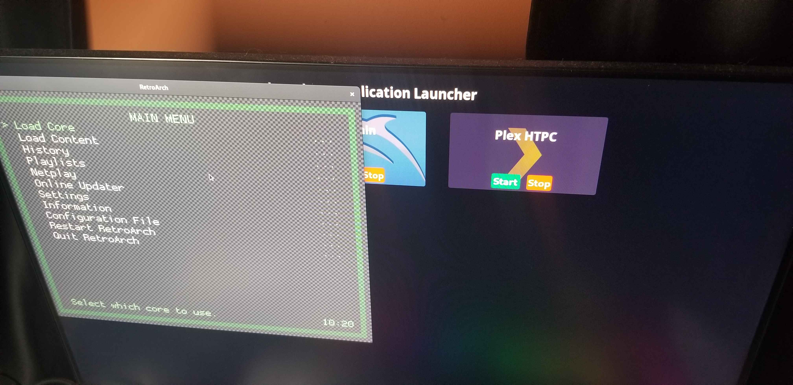

### Wii Sports
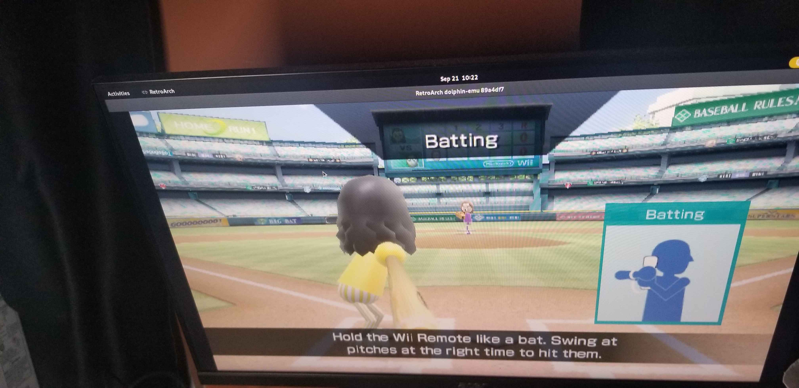

## Setup
### [Mini-PC](https://www.amazon.com/dp/B0D5CS3CDS?ref=ppx_yo2ov_dt_b_fed_asin_title)
The mini-PC I purchased is being used for game/movie streaming along with emulation that does not work through [Steam Link](https://store.steampowered.com/app/353380/Steam_Link/) such as when using a Dolphinbar with [Dolphin](https://dolphin-emu.org/)/[RetroArch](https://www.retroarch.com/) (Wii/GameCube emulator).

The mini-PC has [Debian 12](https://www.debian.org/releases/bookworm/) installed that runs an open source web/desktop application launcher I made [here](https://github.com/gamemann/web-desktop-app-launcher). This application allows me to start/stop programs such as [Steam Link](https://store.steampowered.com/app/353380/Steam_Link/), [RetroArch](https://www.retroarch.com/), [Dolphin](https://dolphin-emu.org/), and [Plex HTPC](https://support.plex.tv/articles/htpc-getting-started/) from the desktop application itself or through a website!

**NOTE** - The [Dolphin](https://dolphin-emu.org/) software was built from [source](https://github.com/dolphin-emu/dolphin?tab=readme-ov-file#building-for-linux-and-macos)! I only use the Dolphin software directly for testing. Everything else I run through [RetroArch](https://www.retroarch.com/) and its cores.

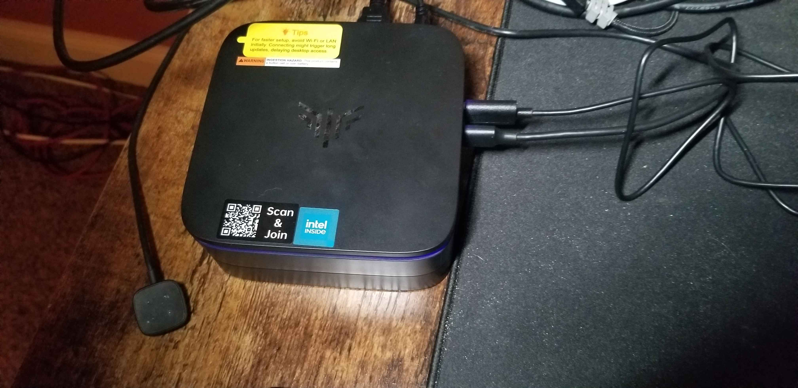

### Wii
#### Remote
I've purchased two Wii Remotes with nunchucks from FASIGO [here](https://www.amazon.com/dp/B0BZDMK99T). While these aren't  *real* Wii remotes, they've worked well with the games I've played so far!

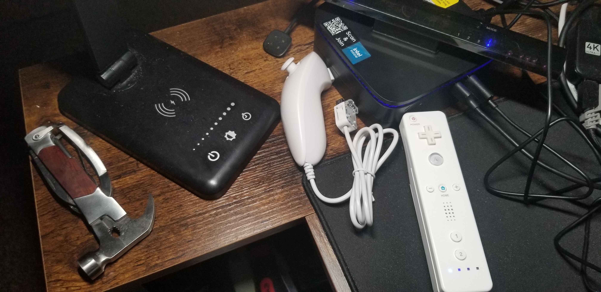

#### Dolphinbar
I've purchased a [MAYFLASH W010 Wireless Sensor Dolphinbar](https://www.amazon.com/dp/B00HZWEB74) for PC. I've set the mode to *4* and use it as a bottom sensor.

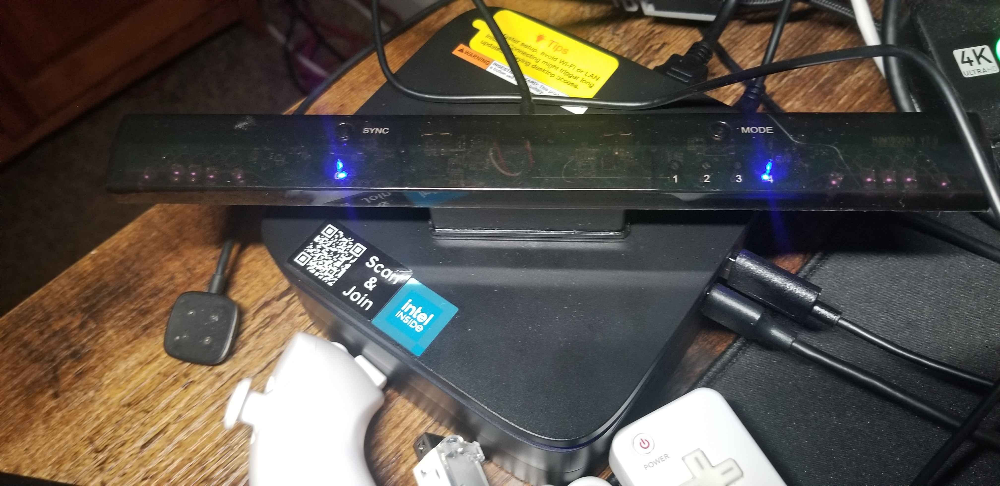

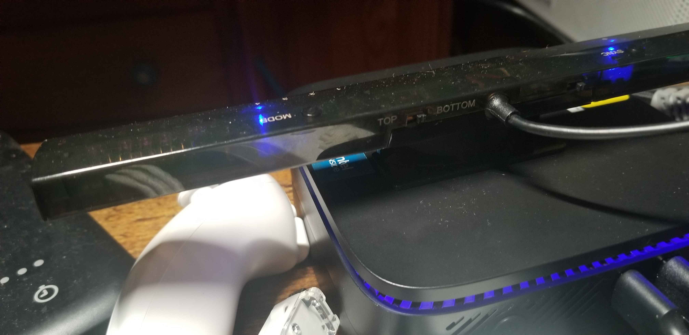

### Home Server
I use one of my [home servers](https://github.com/gamemann/Home-Lab?tab=readme-ov-file#three-spykids) to stream emulated games through [Steam Remote Play](https://store.steampowered.com/remoteplay) and [Steam Link](https://store.steampowered.com/app/353380/Steam_Link/). This home server includes an RTX 2070 since it used to be my older gaming desktop which makes it perfect for game/moving streaming (it doesn't have typical server components, but it is used as a home server).

I use a HDMI dummy plug from [here](https://www.amazon.com/dp/B07FB4VJL9) which allows me to launch games on a virtual monitor from my GPU that supports many resolutions such as 4K (60Hz) or 1920x1080 (120Hz). I personally use the *1920x1080* @ **120Hz** resolution!

## Dolphinbar & Wii Remote Setup
It took me quite a while to get the Dolphinbar and Wii Remotes working as intended on Linux/Debian 12. Everything worked out of the box after changing some Dolphin settings through Windows.

Firstly, make sure your MAYFLASH Dolphinbar's mode is set to 4.

You'll then want to pair/sync your Wii remote(s) with your Dolphinbar by pressing the *Sync* button on the Dolphinbar and the red sync button on your Wii remote (typically located under the battery cover). You may also hit *1* and *2* on your Wii remote at the same time to pair. When the pair is successfuly, your Wii remote should be set to a specific player number indicated by the four square and blue lights on the bottom of the remote.

Afterwards, you'll want to take a look at the README [here](https://github.com/gamemann/my-retro-setup/tree/main/dolphin) and install some scripts, services, and configuration files I ended up needing on Linux/Debian 12. The script/service basically actively scans for BlueTooth devices on boot and the configuration file is related to `udev` rules for the Dolphinbar.

### Dolphin
The following settings should be set when launching games through Dolphin directly. After launching Dolphin, click the "Controllers" button in the top-right and use the following settings.

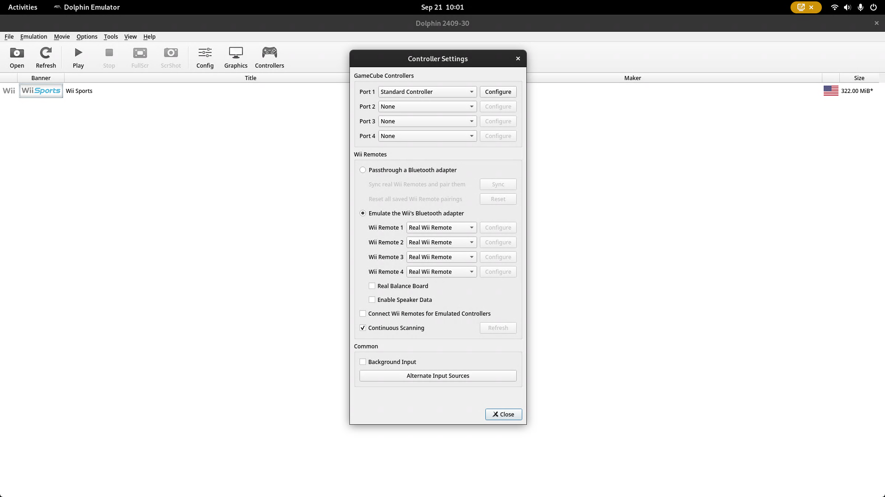

1. Under **Wii Remotes**, select the *Emulate the Wii's Bluetooth adapter* setting.
2. Make sure **Wii Remote 1** through **4** is set to *Real Wii Remote*.
3. Check **Continuous Scanning**.

Afterwards, when launching a game, you should feel the Wii remote rumble once or twice to indicate it's working.

### RetroArch
Before anything, make sure you've installed the Dolphin core through RetroArch (usually you can download it through RetroArch itself via the Online Updater). Afterwards, add whatever content directory your Wii ROMs are located.

To get the Wii remotes to work through RetroArch, you need to first know the shortcut to the quick menu after launching a game. On the keyboard, I believe this is **F1** by default. If you want to map a combo through your controller, you will need to go to **Settings** -> **Input** -> **HotKeys** and set **Menu Toggle (Controller Combo)**.

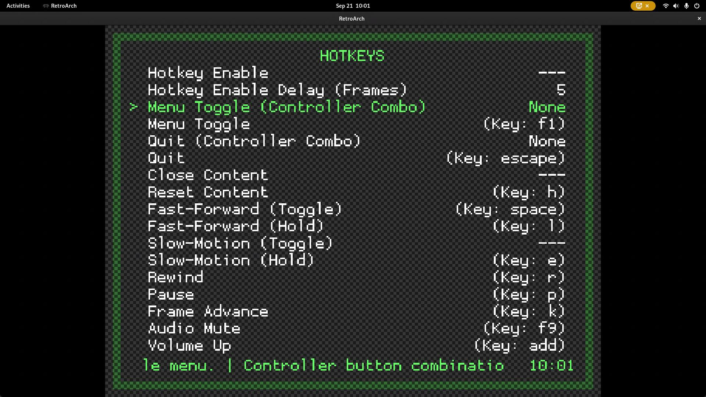

Next, launch the game and hit the menu toggle key. You should see a menu overlayed on whatever game you're playing.

First, we need to set a core setting. Go to **Core Options** and enable **Wiimote Continuous Scanning**.

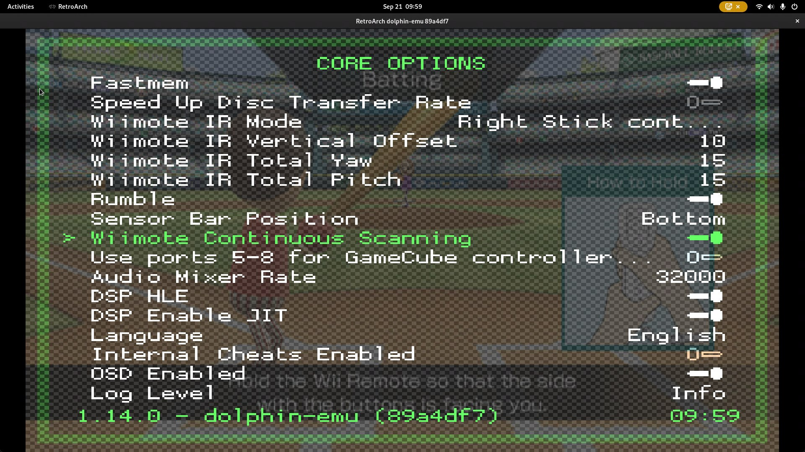

Afterwards, I recommend going to **Manage Core Options** and selecting to save these new settings to a file so they save on reboot.

Next, go back to the main in-game menu and select **Controls**. You'll see **Port *x* Controls** where *x* is a number from *1* to whatever max users you have set through RetroArch's main settings. Depending on how many Wii remotes you want to use, you'll need to go through each **Port *x* Controls** setting and set **Device Type** to *Real Wiimote*.

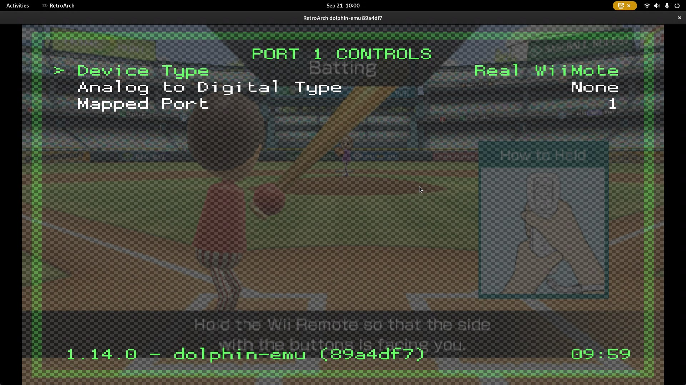

I also recommend going back to the **Controls** menu afterwards, select **Manage Remap Files** and saving the current configuration so that you don't have set these settings on every game launch.

Afterwards, the Wii remote(s) should rumble once or twice and work without needing to do anything else. You can select **Resume** to resume the game.

## Credits
* [Christian Deacon](https://github.com/gamemann)